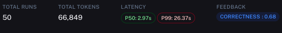
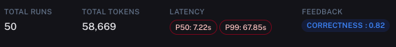
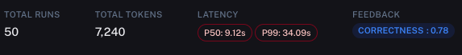
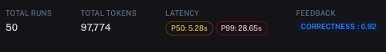

# CSV Question Answering

This module shows how we benchmark question answering over CSV data.
There are several components:

## Setup

To setup, you should install all required packages:

```shell
pip install -r requirements.txt
```

You then need to set environment variables. 
This heavily uses [LangSmith](https://smith.langchain.com/), so you need to set those environment variables:

```shell
export LANGCHAIN_TRACING_V2="true"
export LANGCHAIN_ENDPOINT=https://api.langchain.plus
export LANGCHAIN_API_KEY=...
```

This also uses OpenAI, so you need to set that environment variable:

````shell
export OPENAI_API_KEY=...
````

## How we collected data

To do this, we set up a simple streamlit app that was logging questions, answers, and feedback to LangSmith.
We then annotated examples in [LangSmith](https://smith.langchain.com/) and added them to a dataset we were creating.
For more details on how to do this generally, see [this cookbook](https://github.com/langchain-ai/langsmith-cookbook/tree/main/feedback-examples/streamlit)

When doing this, you probably want to specific a project for all runs to be logged to:

```shell
export LANGCHAIN_PROJECT="Titanic CSV"
```

The [`streamlit_app.py`](data.csv) file contains the exact code used to run the application.
You can run this with `streamlit run streamlit_app.py`

## What the data is

See [`data.csv`](data.csv) for the data points we labeled.

## How we evaluate

In order to evaluate, we first upload our data to [LangSmith](https://smith.langchain.com/), with dataset name `Titanic CSV`.
This is done in [`upload_data.py`](upload_data.py). You can run this with:

```shell
python upload_data.py
```

This allows us to track different evaluation runs against this dataset.
We then use a standard `qa` evaluator to evaluate whether the generated answers are correct are not.

We include scripts for evaluating a few different methods:

## [Pandas Agent, GPT-3](pandas_agent_gpt_35.py)

Run with `python pandas_agent_gpt_35.py`

Results:



## [Pandas Agent, GPT-4](pandas_agent_gpt_4.py)

Run with `python pandas_agent_gpt_4.py`

Results:



## [PandasAI](pandas_ai.py)

Need into install more packages:

```shell
pip install beautifulsoup4 pandasai
```
Then can run with `python pandas_ai.py`

Results (note token tracking is off because not using LangChain):



## [Custom Agent](custom_agent.py)

A custom agent equipped with a custom prompt and some custom tools (Python REPL and vectorstore)

Run with `python custom_agent.py`

Results:


